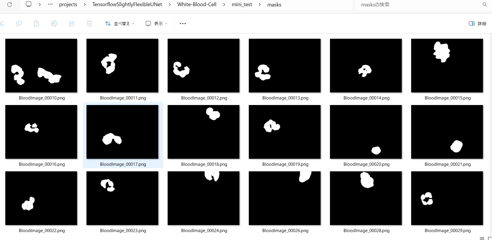
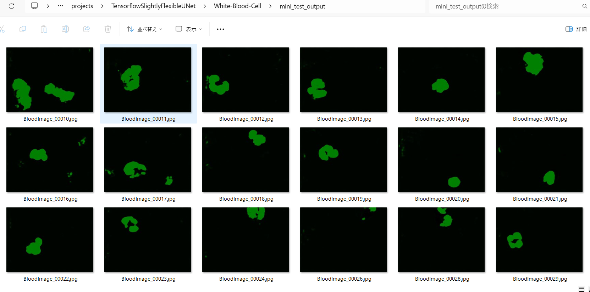

<h2>Tensorflow-Image-Segmentation-White-Blood-Cell (2024/07/17)</h2>

This is the first experiment of Image Segmentation for 
<a href="https://github.com/arbackes/White-Blood-Cell-dataset">White-Blood-Cell-dataset</a> based on
the <a href="https://github.com/sarah-antillia/Tensorflow-Image-Segmentation-API">Tensorflow-Image-Segmentation-API</a>,  
 
As mentioned in recent study <a href="https://www.sciencedirect.com/science/article/pii/S0169260718311064#bbib0033">
Recent computational methods for white blood cell nuclei segmentation: A comparative study
</a>, 
the various techniques were developed to precisely identify blood cell regions. 
In this experiment, we applied an RGB-to-HSV color conversion to the input images to enhance the stained 
white blood cell regions.
 
<table>
<tr>
<th>RGB</th>
<th>HSV</th>
<th>Mask</th>
</tr>
<tr>
<td></td>
<td></td>
<td></td>

</tr>

</table>
 

<b>Actual Image Segmentation</b> 
The inferred green-colorized masks predicted by our segmentation model trained on the White-Blood-Cell ImageMaskDataset appear similar 
to the ground truth masks, but lack precision in some areas. To improve segmentation accuracy, we could consider 
using a different segmentation model better suited for this task, or explore online data augmentation strategies.
<table>
<tr>
<th>Input: image</th>
<th>Mask (ground_truth)</th>
<th>Prediction: inferred_mask</th>
</tr>
<tr>
<td></td>
<td></td>
<td></td>
</tr>

<tr>
<td></td>
<td></td>
<td></td>
</tr>
<tr>
<td></td>
<td></td>
<td></td>
</tr>

</table>

 
In this experiment, we have used the simple UNet Model 
<a href="./src/TensorflowUNet.py">TensorflowSlightlyFlexibleUNet</a> for this Oral Cancer Segmentation. 
As shown in <a href="https://github.com/sarah-antillia/Tensorflow-Image-Segmentation-API">Tensorflow-Image-Segmentation-API</a>.
you may try other Tensorflow UNet Models: 

<li><a href="./src/TensorflowSwinUNet.py">TensorflowSwinUNet.py</a></li>
<li><a href="./src/TensorflowMultiResUNet.py">TensorflowMultiResUNet.py</a></li>
<li><a href="./src/TensorflowAttentionUNet.py">TensorflowAttentionUNet.py</a></li>
<li><a href="./src/TensorflowEfficientUNet.py">TensorflowEfficientUNet.py</a></li>
<li><a href="./src/TensorflowUNet3Plus.py">TensorflowUNet3Plus.py</a></li>
<li><a href="./src/TensorflowDeepLabV3Plus.py">TensorflowDeepLabV3Plus.py</a></li>

 

<h3>1. Dataset Citatioin</h3>

The original dataset used here has been taken
<a href="https://github.com/arbackes/White-Blood-Cell-dataset">White-Blood-Cell-datasetWhite-Blood-Cell-dataset</a> 
 
The database contains 367 images of leukocytes stained with hematoxylin and eosin (H & E), obtained using the Gismo Right technique 
with a microscope and a CCD camera to generate 640 x 480 images in RGB format. 
 
<!--
<b>Lincense</b> Unknown
 -->
<!--
The images of the dataset above seems to be taken from the following dataset on github;
<pre>
https://github.com/cosmicad/dataset
</pre>
-->
 
 
<h3>
2 White-Blood-Cell ImageMask Dataset
</h3>
 If you would like to train this White-Blood-Cell Segmentation model by yourself,
please clone the original Github repository
<a href="https://github.com/arbackes/White-Blood-Cell-dataset">White-Blood-Cell-datasetWhite-Blood-Cell-dataset</a> 
to your local environment. Please expand downloaded <i>BloodImageSetS6NucSeg.zip</i> and <i>BloodImageSetS6NucSeg_masks.zip</i> 
in the enviroment
, and place them under
<b>./generator</b> folder as shown below. 
<pre>
/generator
├─BloodImageSetS6NucSeg
│  ├─BloodImage_00000.jpg
...
│  └─BloodImage_00410,jpg
├─BloodImageSetS6NucSeg_masks
│  ├─BloodImage_00000.png
...
│  └─BloodImage_00410.png

├─ImageMaskDatasetGenerator.py
└─split_master.py
</pre>
Next, please run <a href="./generator/ImageMaskDatasetGenerator.py">ImageMaskDatasetGenerator.py
</a> and <a href="./generator/split_master.py">split_master.py</a> in <b>./generator</b>. Finally, <b>White-Boold-Cell</b> folder
will be created under <b>./dataset</b> folder as shown below. 
</pre>

<pre>
./dataset
└─White-Blood-Cell
    ├─test
    │   ├─images
    │   └─masks
    ├─train
    │   ├─images
    │   └─masks
    └─valid
        ├─images
        └─masks
</pre>

<b>White-Blood-Cell Dataset Statistics</b> 
 
 
As shown above, the number of images of train and valid dataset is very small. 
Probably, an online dataset augmentation strategy may be effective to improve segmentation accuracy.
 

 
<b>Train_images_sample</b> 

 
<b>Train_masks_sample</b> 

 

<h3>
3 Train TensorflowUNet Model
</h3>
 We have trained White-Blood-Cell TensorflowUNet Model by using the following
<a href="./projects/TensorflowSlightlyFlexibleUNet/White-Blood-Cell/train_eval_infer.config"> <b>train_eval_infer.config</b></a> file.  
Please move to ./projects/White-Blood-Cell and run the following bat file. 
<pre>
>1.train.bat
</pre>
This simply runs the following command. 
<pre>
>python ../../../src/TensorflowUNetTrainer.py ./train_eval_infer.config
</pre>

<pre>
; train_eval_infer.config
; 2024/07/19 (C) antillia.com

[model]
model          = "TensorflowUNet"
generator      = False
image_width    = 512
image_height   = 512
image_channels = 3
input_normalize = False
normalization  = True
num_classes    = 1
base_filters   = 16
base_kernels   = (7,7)
num_layers     = 8
dropout_rate   = 0.05
learning_rate  = 0.0001
clipvalue      = 0.5
dilation       = (1,1)
;loss           = "bce_iou_loss"
loss           = "bce_dice_loss"
;metrics        = ["binary_accuracy"]
metrics        = ["dice_coef"]
show_summary   = False

[train]
epochs        = 100
batch_size    = 2
steps_per_epoch  = 200
validation_steps = 80
patience      = 10

;metrics       = ["iou_coef", "val_iou_coef"]
metrics       = ["dice_coef", "val_dice_coef"]
;metrics       = ["binary_accuracy", "val_binary_accuracy"]

model_dir     = "./models"
eval_dir      = "./eval"
image_datapath = "../../../dataset/White-Blood-Cell/train/images/"
mask_datapath  = "../../../dataset/White-Blood-Cell/train/masks/"

;Inference execution flag on epoch_changed
epoch_change_infer     = True

; Output dir to save the inferred masks on epoch_changed
epoch_change_infer_dir =  "./epoch_change_infer"

;Tiled-inference execution flag on epoch_changed
epoch_change_tiledinfer     = False

; Output dir to save the tiled-inferred masks on epoch_changed
epoch_change_tiledinfer_dir =  "./epoch_change_tiledinfer"

; The number of the images to be inferred on epoch_changed.
num_infer_images       = 1
create_backup  = False

learning_rate_reducer = True
reducer_factor     = 0.2
reducer_patience   = 5
save_weights_only  = True

[eval]
image_datapath = "../../../dataset/White-Blood-Cell/valid/images/"
mask_datapath  = "../../../dataset/White-Blood-Cell/valid/masks/"

[test] 
image_datapath = "../../../dataset/White-Blood-Cell/test/images/"
mask_datapath  = "../../../dataset/White-Blood-Cell/test/masks/"

[infer] 
images_dir    = "./mini_test/images"
output_dir    = "./mini_test_output"

[segmentation]
colorize      = True
black         = "black"
white         = "green"
blursize      = None

[image]
color_converter = "cv2.COLOR_BGR2HSV"
gamma           = 0

[mask]
blur      = False
blur_size = (3,3)
binarize  = False
;threshold = 128
threshold = 80

[generator]
debug        = False
augmentation = True

[augmentor]
vflip    = True
hflip    = True
rotation = True
angles   = [90, 180, 270, 300,]
shrinks  = [0.6, 0.8]
shears   = [0.1]

deformation = True
distortion  = True
sharpening  = True
brightening = True
; 2024/07/08
barrdistortion = True

[deformation]
alpah     = 1300
sigmoids  = [8.0]

[distortion]
gaussian_filter_rsigma= 40
gaussian_filter_sigma = 0.5
distortions           = [0.02, 0.03]

[barrdistortion]
radius = 0.3
amount = 0.3
centers =  [(0.3, 0.3), (0.7, 0.3), (0.5, 0.5), (0.3, 0.7), (0.7, 0.7)]

[sharpening]
k        = 1.0

[brightening]
alpha  = 1.2
beta   = 10  
</pre>

<b>Model parameters</b> 
Defined small <b>base_filters</b> and large <b>base_kernels</b> for the first Conv Layer of Encoder Block of 
<a href="./src/TensorflowUNet.py">TensorflowUNet.py</a> 
and large num_layers (including a bridge between Encoder and Decoder Blocks).
<pre>
[model]
base_filters   = 16 
base_kernels   = (7,7)
num_layers     = 8
</pre>

<b>Online augmentation</b> 
Disabled our online augmentation. To enable the augmentation, set generator parameter to True.  
<pre>
[model]
model         = "TensorflowUNet"
generator     = False
</pre>

<b>Loss and metrics functions</b> 
Specified "bce_dice_loss" and "dice_coef". 
<pre>
[model]
loss           = "bce_dice_loss"
metrics        = ["dice_coef"]
</pre>
<b>Learning rate reducer callback</b> 
Enabled learing_rate_reducer callback. 
<pre> 
[train]
reducer_factor     = 0.2
reducer_patience   = 5
save_weights_only  = True
</pre>
<b>Early stopping callback</b> 
Enabled early stopping callback with patience parameter.
<pre>
[train]
patience      = 10
</pre>

<b>Color converter</b> 
Specified color_convert to use "cv2.COLOR_BGR2HSV".
<pre>
[image]
color_converter = "cv2.COLOR_BGR2HSV"
</pre>

<b>Epoch change inference callback</b> 
Enabled EpochChange infer callback. 
<pre>
[train]
epoch_change_infer     = True
epoch_change_infer_dir =  "./epoch_change_infer"
num_infer_images       = 1
</pre>

By using this EpochChangeInference callback, on every epoch_change, the inference procedure can be called
 for an image in <b>mini_test</b> folder. This will help you confirm how the predicted mask changes at each epoch during your training process.    

<b>Epoch_change_inference output</b> 
 
 
 
In this case, the training process stopped at epoch 35 by EarlyStopping Callback as shown below. 
<b>Training console output</b> 
 
 
 
<a href="./projects/TensorflowSlightlyFlexibleUNet/White-Blood-Cell/eval/train_metrics.csv">train_metrics.csv</a> 
 

 
<a href="./projects/TensorflowSlightlyFlexibleUNet/White-Blood-Cell/eval/train_losses.csv">train_losses.csv</a> 
 

 

<h3>
4 Evaluation
</h3>
Please move to a <b>./projects/TensorflowSlightlyFlexibleUNet/White-Blood-Cell</b> folder, 
and run the following bat file to evaluate TensorflowUNet model for White-Blood-Cell. 
<pre>
./2.evaluate.bat
</pre>
This bat file simply runs the following command.
<pre>
python ../../../src/TensorflowUNetEvaluator.py ./train_eval_infer_aug.config
</pre>

<b>Evaluation console output</b> 

  

<a href="./projects/TensorflowSlightlyFlexibleUNet/White-Blood-Cell/evaluation.csv">evaluation.csv</a> 

The loss (bce_dice_loss) score for this test dataset is not so low, and dice_coef not so high as shown below. 
<pre>
loss,0.1959
dice_coef,0.6743
</pre>

<h3>
5 Inference
</h3>
Please move to a <b>./projects/TensorflowSlightlyFlexibleUNet/White-Blood-Cell</b> folder 
,and run the following bat file to infer segmentation regions for images by the Trained-TensorflowUNet model for White-Blood-Cell. 
<pre>
./3.infer.bat
</pre>
This simply runs the following command.
<pre>
python ../../../src/TensorflowUNetInferencer.py ./train_eval_infer_aug.config
</pre>

<b>mini_test_images</b> 
 
<b>mini_test_mask(ground_truth)</b> 
 

<b>Inferred test masks</b> 
 
 

<b>Enlarged Images and Masks Comparison</b> 
<table>
<tr>
<th>Image</th>
<th>Mask (ground_truth)</th>
<th>Inferred-mask</th>
</tr>

<tr>
<td></td>
<td></td>
<td></td>
</tr>

<tr>
<td></td>
<td></td>
<td></td>
</tr>

<tr>
<td></td>
<td></td>
<td></td>
</tr>

<tr>
<td></td>
<td></td>
<td></td>
</tr>

<tr>
<td></td>
<td></td>
<td></td>
</tr>

</table>

 
 

<h3>
References
</h3>
<b>1. An efficient algorithm for detection of white blood cell nuclei using adaptive three stage PCA-based fusion</b> 
Mimosette Makem, Alain Tiedeu 
https://doi.org/10.1016/j.imu.2020.100416 

<pre>
 https://www.sciencedirect.com/science/article/pii/S2352914820305669
 </pre>
 
<b>2. White-Blood-Cell-dataset</b> 
André Backes 
<pre>
https://github.com/arbackes/White-Blood-Cell-dataset
</pre>
 
<b>3. Recent-Computational-Methods-for-White-Blood-Cell-Nuclei-Segmentation-A-Comparative-Study</b> 
Luis Henrique Silva Vogado 

<pre>
https://github.com/lhvogado/Recent-Computational-Methods-for-White-Blood-Cell-Nuclei-Segmentation-A-Comparative-Study
</pre>

